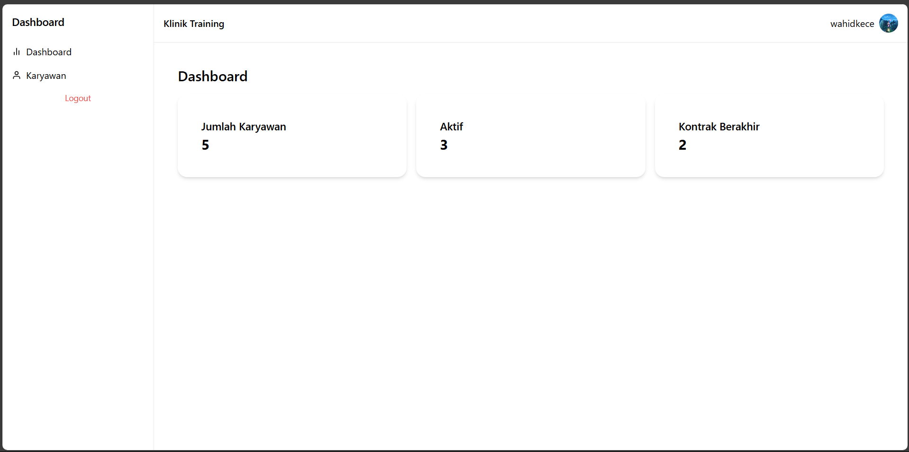
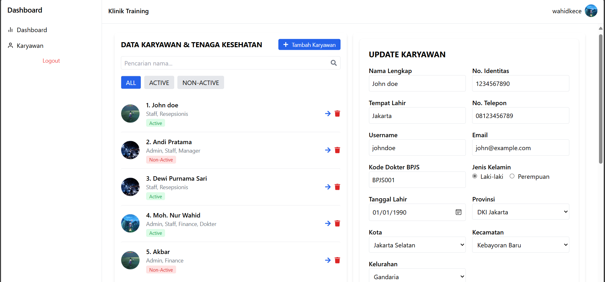

# Getting Started with Create React App

This project was bootstrapped with [Create React App](https://github.com/facebook/create-react-app).

## Available Scripts

In the project directory, you can run:

### `git Clone`

### `npm install`

### `npm start`

Dashboard Page:

Employee Page:

Runs the app in the development mode.\
Open [http://localhost:3000](http://localhost:3000) to view it in your browser.

Fitur :

1.  Simple Dashboard
2.  Login
    - user default:
      username: admin
      password: admin123456
3.  CRUD and Show Detail Employee
4.  Validation Yup

The page will reload when you make changes.\
You may also see any lint errors in the console.
